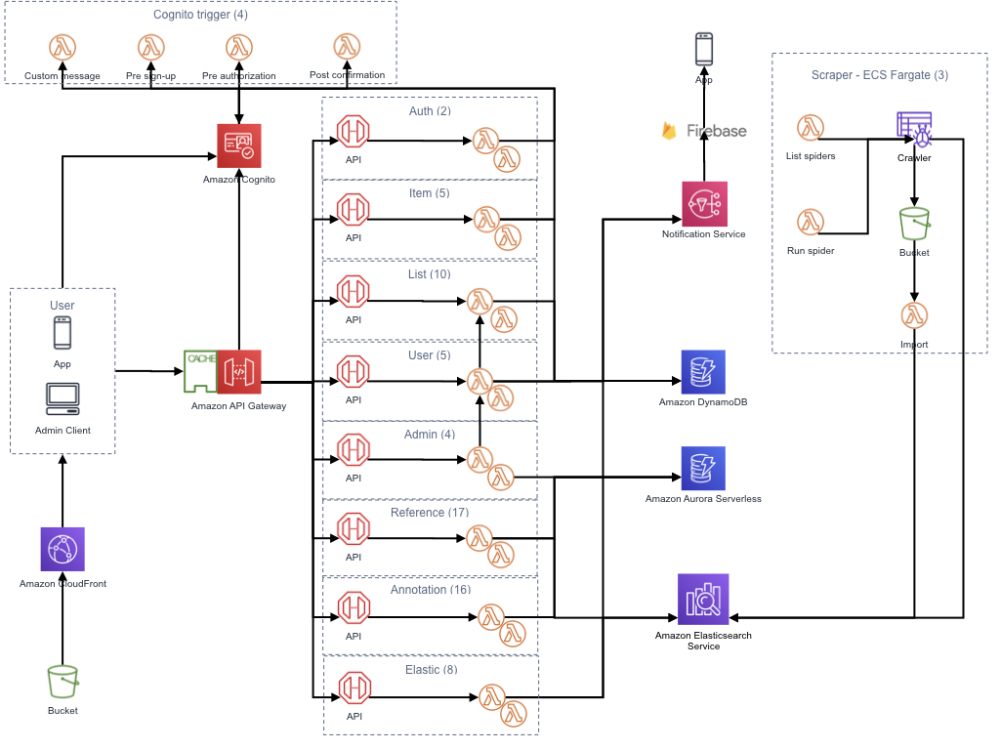
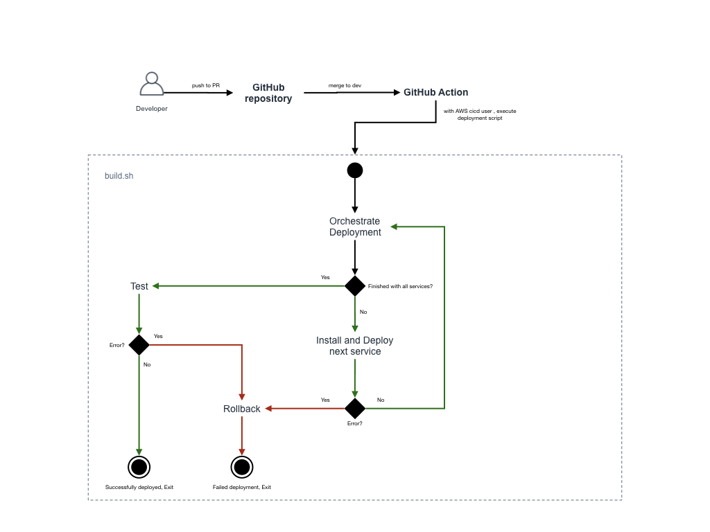

# Scaleable Microservices in Lambda with Terraform and the Serverless Framework
This is a stripped down version of a scaleable microservice application using AWS Lambda functions as the base. It is provided here as an exmaple of how we structured the project. The project infrastructure is shown below. This infrastructure supported a grocery list application that allowed users to browse and search promotions from 15 retailers across the Netherlands. Users were able to add products from multiple retailers to an interactable list, receive notifications when favourite products are on offer and share lists in a near realtime fashion with family members. It's hosted in AWS and uses mainly Lambda, API Gateway, Cognito, DynamoDB, ElasticSearch, ECS Fargate & CloudWatch. This repo provides only the Serverless Functions/API Endpoints for the App Project and the rest of the infrastructure is deployed using a separate terraform project.

The project was unfortunatley discontinued despite showing freat potential. There was still plent more left to do on the project, it had only just started to fly.

# Architecture
This repo only contains the lambda stack seen in the diagram. The rest is managed in terraform which is found in a separate more private repo also co-authored by me.

<p>
  
</p>

# Structure (Microservices + Mono-Repo)

Based on ideas from [Serverless Stack](https://serverless-stack.com/chapters/organizing-serverless-projects.html) and [Seed](https://seed.run/blog/how-to-structure-a-real-world-monorepo-serverless-app)

File structure looks something similar to this
```
/
  package.json          # Global shared packages
  config.yml            # Global shared serverless deploy settings
  libs/                 # Global shared libraries (Like AWS SDK)
  services/             # Where the separate serverless apps live
    elastic-service/
      package.json      # Individual packages
      serverless.yml    # Individual serverless deploy settings
      events/           # Expected inputs to handler functions for testing
      handlers/         # Actual functions
      validation/       # Specific validation functions for handlers
      ...               # Any other module specific libraries that may be developed
    stats-service/
      serverless.yml
      handlers/
    users-service/
      serverless.yml
      handlers/
```

This setup implies that when you are deploying, you’ll need to do an npm install twice. Once in the root level and once in a specific service.

We are using the `serverless-bundle` plugin that internally uses `Webpack` to only package the code that our Lambda function needs.

See the services [README.md](./services/) for more insights.

## Data Stores
This application interacted with 4 main data stores (DynamoDB, ElasticSearch, Aurora Serverless & S3). We relied heavily on the AWS SDK to acheive this and became quite adept at using it. The DynamoDB table structures were carefully thought out to adapt the `mono-table` design, trying to achieve as much utility as we could out of a single table by utilising high-cardinality attributes, composite keys with composite attributes and overloading GSIs. Contact me for more information on how we structured the table.

# Installation

Run

`sh install.sh --service stats-service`

# Deploy

Use the correct AWS Profile profile! We have two environments: `[production, dev]`

An example of deploying to production is like so:

`sh deploy.sh --service stats-service --aws-profile aws-profile --stage production`

Default profile and stage in the `deploy.sh` file is `aws-profile` and `dev` in case you accidentally forget the params.

The API Gateway setup is managed by terraform. The same for the authorisors which are provided by Cognito, also managed by terraform.

In order to deploy single function:

`sls deploy -f funciton-name --stage dev --aws-profile aws-profile`

To invoke the function locally:

`sls invoke local -f function-name --stage dev --aws-profile aws-profile`

# CI/CD

The admin dashboard and the scrapers are deployed automatically with AWS CodeBuild and AWS Pipeline. For the microservies, we have a semi-automatic pipeline with custom script that triggers via a github action. It detects what services have been mpdified and deploys accordingly.

<p>
  
</p>